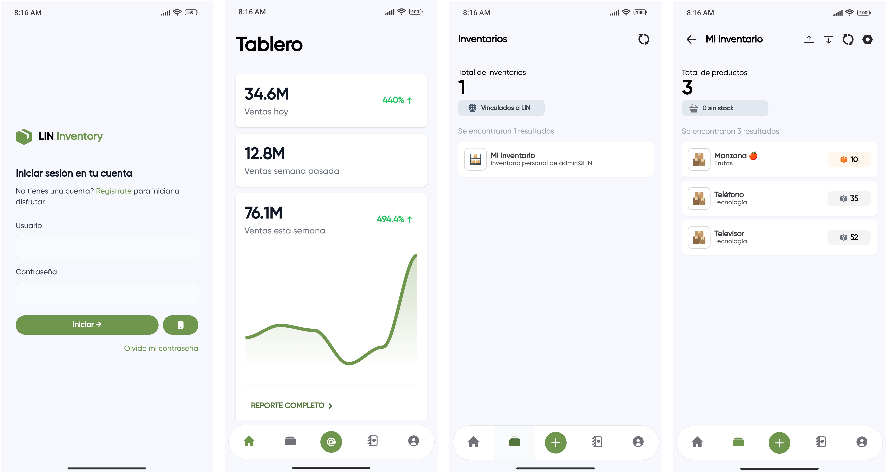
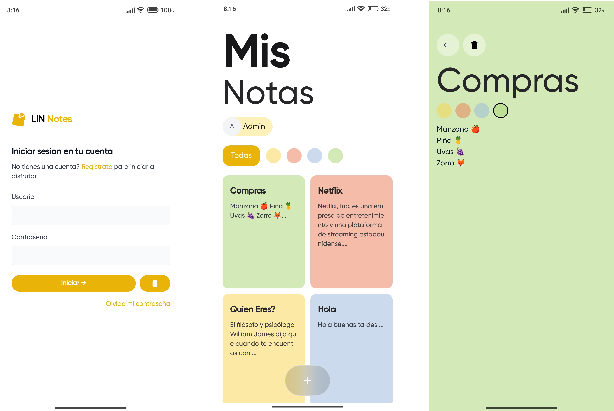
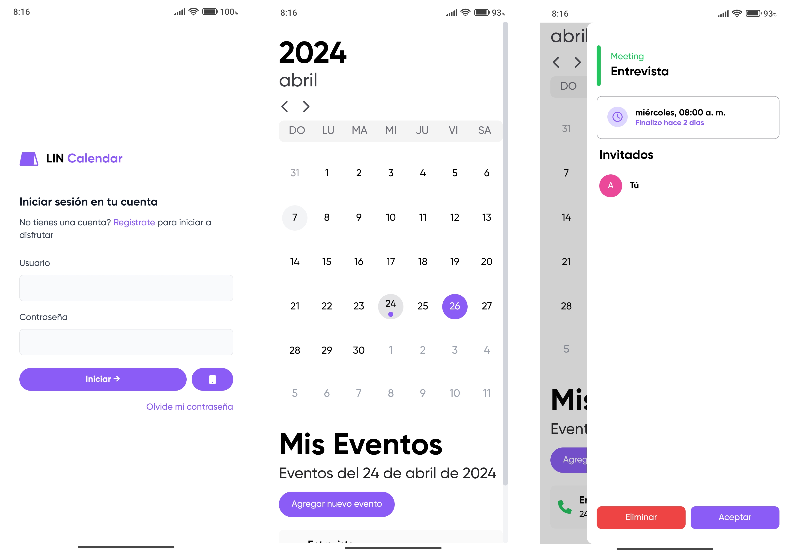
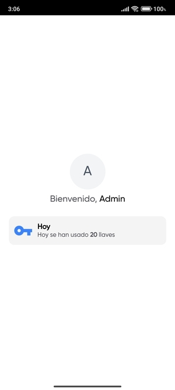

# ¡Hola! 👋 Soy Alexander
¡Bienvenido a mi perfil de GitHub! Soy un apasionado desarrollador .NET con experiencia en el desarrollo de aplicaciones web y de escritorio. Me encanta crear soluciones innovadoras y resolver problemas desafiantes. Aquí encontrarás algunos de mis proyectos y contribuciones.

## Sobre mí
* 💻 Desarrollador .NET.
* 🌱 Siempre aprendiendo y explorando nuevas tecnologías.
* 📫 Puedes contactarme a través de mi correo electrónico.

## Tecnologías
* 🖥️ .NET Framework/.NET Core
* 🌐 ASP.NET MVC/WebAPI
* 📱 Xamarin.Forms
* 🛠️ SQL Server/Entity Framework
* 🌐 Razor - Blazor

## Proyectos destacados

### 🌟 LIN Inventory

### 🌟 LIN Allo

Aplicación nativa (Android y Windows)

Aplicación web

### 🌟 LIN Notes

### 🌟 LIN Calendar

Aplicación nativa (Android y Windows)

Aplicación web

### 🌟 LIN Vault

## Revisa mas de mis proyectos.

### LIN
Revisa los proyectos de LIN

### LIN Experimental
Revisa los proyectos de código abierto y libre.

